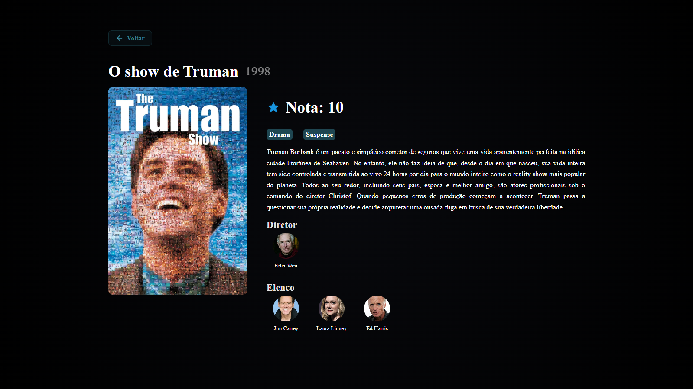

# Trabalho Prático - Semana 11

Nesta atividade, vamos dar continuidade ao projeto desenvolvido ao longo deste semestre, acrescentando a página de detalhes da aplicação.

Imagine que a página principal (home-page) mostre uma visão dos vários itens que existem no seu site. Ao clicar em um item, você é direcionado para a página de detalhes. A página de detalhes vai mostrar todas as informações sobre o item do seu projeto, seja esse item uma notícia, filme, receita, lugar turístico ou evento.

## Informações Gerais

- Nome: Matheus Felipe Costa William
- Matrícula: 927495
- Descreva brevemente seu projeto: Um repositório de filmes avalidados pelo usuário.

## Prints do trabalho




## Dados em JSON
Inclua abaixo a estrutura de dados definida para o seu projeto, apresentando pelo menos dois exemplos de registros em formato JSON.

```json
[
  {
    "id": 1,
    "titulo": "500 dias com ela",
    "tipo": "filme",
    "ano": 2009,
    "generos": ["romance", "comedia"],
    "nota": 8.5,
    "assistido": true,
    "descricao": "Uma comédia romântica não convencional que desconstrói os clichês do gênero. Tom Hansen, um arquiteto frustrado que trabalha escrevendo cartões de felicitações, apaixona-se perdidamente pela nova colega de trabalho, Summer Finn. O filme narra de forma não linear os 500 dias do relacionamento deles, explorando a obsessão romântica de Tom, as diferentes expectativas do casal e o doloroso processo de amadurecimento após o término, enquanto ele tenta decifrar onde tudo deu errado e redescobre seu verdadeiro propósito de vida.",
    "capa": "https://www.themoviedb.org/t/p/w600_and_h900_face/gBwfLH17Dw1b7R2hSaJJ5TBPkGc.jpg",
    "link": "https://www.themoviedb.org/movie/19913-500-days-of-summer",
    "diretores": [
      {
        "nome": "Marc Webb",
        "foto": "https://media.themoviedb.org/t/p/w300_and_h450_face/95FAAT150Mi6DB8VcJgEeOplOsU.jpg",
        "tmdb": "https://www.themoviedb.org/person/87742-marc-webb"
      }
    ],
    "elenco": [
      {
        "nome": "Joseph Gordon-Levitt",
        "foto": "https://media.themoviedb.org/t/p/w300_and_h450_face/z2FA8js799xqtfiFjBTicFYdfk.jpg",
        "tmdb": "https://www.themoviedb.org/person/24045-joseph-gordon-levitt"
      },
      {
        "nome": "Zooey Deschanel",
        "foto": "https://media.themoviedb.org/t/p/w300_and_h450_face/oNnMSaLlPyieTc01ObJZb7ezgGq.jpg",
        "tmdb": "https://www.themoviedb.org/person/11664-zooey-deschanel"
      },
      {
        "nome": "Chloë Grace Moretz",
        "foto": "https://media.themoviedb.org/t/p/w300_and_h450_face/yq4rYmaTRC5degaOYmJQFpaiho1.jpg",
        "tmdb": "https://www.themoviedb.org/person/56734-chloe-grace-moretz"
      }
    ]
  },
  {
    "id": 2,
    "titulo": "Clube da Luta",
    "tipo": "filme",
    "ano": 1999,
    "generos": ["ação", "suspense"],
    "nota": 10,
    "assistido": true,
    "descricao": "Um marco do cinema contemporâneo que critica de forma visceral o consumismo e a crise da masculinidade moderna. Um narrador sem nome, atormentado por uma insônia crônica e pelo vazio de sua vida corporativa perfeita, encontra o excêntrico e carismático vendedor de sabão Tyler Durden. Juntos, eles fundam o 'Clube da Luta', um grupo subterrâneo onde homens podem extravasar suas frustrações físicas. A iniciativa rapidamente sai de controle e evolui para uma organização revolucionária de teor anarquista conhecida como Projeto Caos, culminando em uma reviravolta psicológica impactante.",
    "capa": "https://www.themoviedb.org/t/p/w600_and_h900_face/jSziioSwPVrOy9Yow3XhWIBDjq1.jpg",
    "link": "https://www.themoviedb.org/movie/550-fight-club",
    "diretores": [
      {
        "nome": "David Fincher",
        "foto": "https://media.themoviedb.org/t/p/w300_and_h450_face/tpEczFclQZeKAiCeKZZ0adRvtfz.jpg",
        "tmdb": "https://www.themoviedb.org/person/7467-david-fincher"
      }
    ],
    "elenco": [
      {
        "nome": "Brad Pitt",
        "foto": "https://media.themoviedb.org/t/p/w300_and_h450_face/m09Y1YfPPeNYYUSHnnVqahkrC1o.jpg",
        "tmdb": "https://www.themoviedb.org/person/287-brad-pitt"
      },
      {
        "nome": "Edward Norton",
        "foto": "https://media.themoviedb.org/t/p/w300_and_h450_face/8nytsqL59SFJTVYVrN72k6qkGgJ.jpg",
        "tmdb": "https://www.themoviedb.org/person/819-edward-norton"
      },
      {
        "nome": "Helena Bonham Carter",
        "foto": "https://media.themoviedb.org/t/p/w300_and_h450_face/hJMbNSPJ2PCahsP3rNEU39C8GWU.jpg",
        "tmdb": "https://www.themoviedb.org/person/1283-helena-bonham-carter"
      }
    ]
  }
]
```


